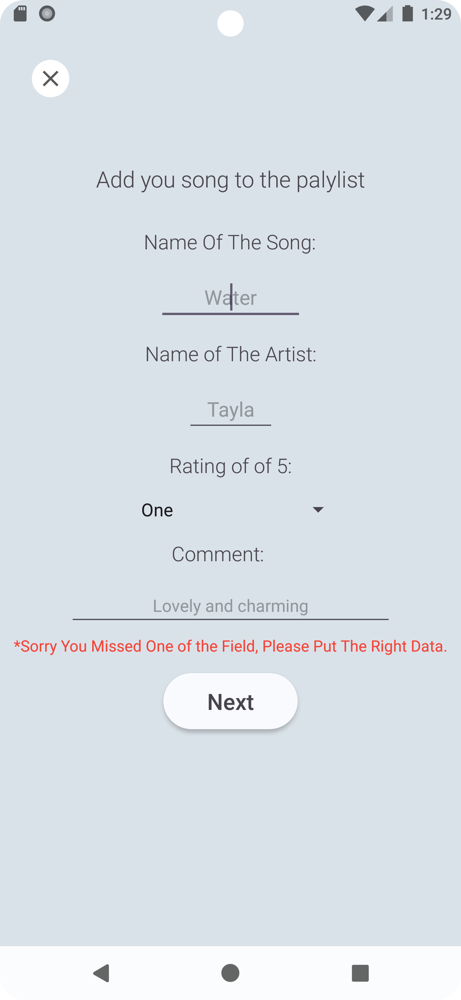
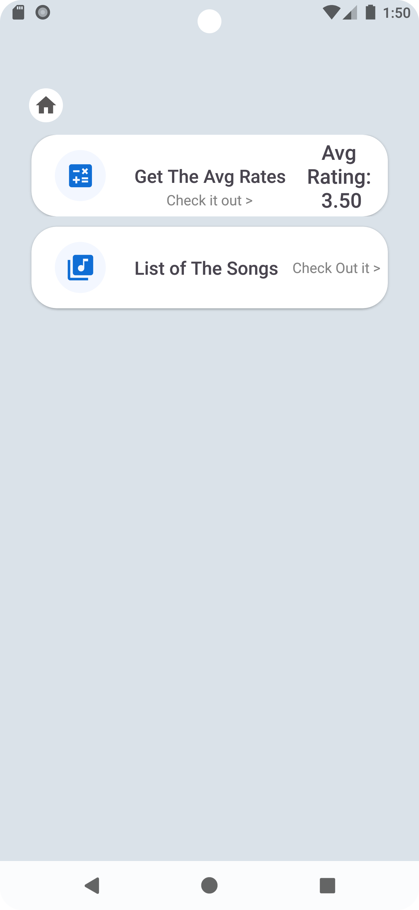

# Musically - Music Playlist App

This project was developed as a comprehensive music playlist application that allows users to track their favorite songs and rate them.
This App is Made By Mazen Ba Hamid | ST10486439

---

### **Table of Contents**

1.  [🧑‍💻 Developer Information](#-developer-information)
2.  [🔗 GitHub Repository Link](#-github-repository-link)
3.  [📝 Application Purpose](#-application-purpose)
4.  [✨ Core Features](#-core-features)
5.  [📸 Application Screenshots](#-application-screenshots)
6.  [🛠️ Technology Stack](#-technology-stack)

---

### **🧑‍💻 Developer Information**

-   **Project:** `Musically - Android Music Playlist Application`

---

### **🔗 GitHub Repository Link**

The complete source code for this project is available on GitHub:
[https://github.com/x0Mazen/Musically]https://github.com/x0Mazen/Musically)

---

### **📝 Application Purpose**

The Musically App is designed to provide users with a comprehensive music playlist management experience. The application allows users to create and view their personal music playlists, add new songs with ratings and comments, and view detailed information about their music collection. Users can track their favorite songs, rate them on a scale of 1-5, and add personal comments about each track, making it a versatile tool for both music enthusiasts and casual listeners.

---

### **✨ Core Features**

-   **Song Playlist Management:** Add and view songs in your personal playlist with artist information.
-   **Rating System:** Rate songs on a scale of 1-5 stars based on personal preference.
-   **Comments & Notes:** Add personal comments or notes about each song in your playlist.
-   **Detailed Song View:** Access comprehensive information about each song including title, artist, rating, and comments.
-   **Rating Analytics:** View the average rating of all songs in your playlist.
-   **Visual Rating Indicators:** Intuitive star icons representing different rating levels.

---

### **📸 Application Screenshots**

#### **Main Screen**
<table>
  <tr>
    <td>Main Screen</td>
  </tr>
  <tr>
    <td></td>
  </tr>
</table>

#### **Detailed View Screen**
<table>
  <tr>
    <td>Detailed View Screen</td>
  </tr>
  <tr>
    <td></td>
  </tr>
</table>

#### **Add Song Screen**
<table>
  <tr>
    <td>Add Song Screen</td>
  </tr>
  <tr>
    <td></td>
  </tr>
</table>

#### **Handling Error**
<table>
  <tr>
    <td>Handling Errors If the User Ad Invalid Data</td>
  </tr>
  <tr>
    <td></td>
  </tr>
</table>

#### **Display Avg**
<table>
  <tr>
    <td>Display Avg</td>
  </tr>
  <tr>
    <td></td>
  </tr>
</table>
---

### **🛠️ Technology Stack**

-   **Programming Language:** Kotlin
-   **IDE:** Android Studio
-   **UI Design:** XML with Material Design components
-   **Architecture Pattern:** Activity-based with ViewBinding
-   **Data Management:** In-memory data structure with serialization
-   **Version Control:** Git & GitHub
